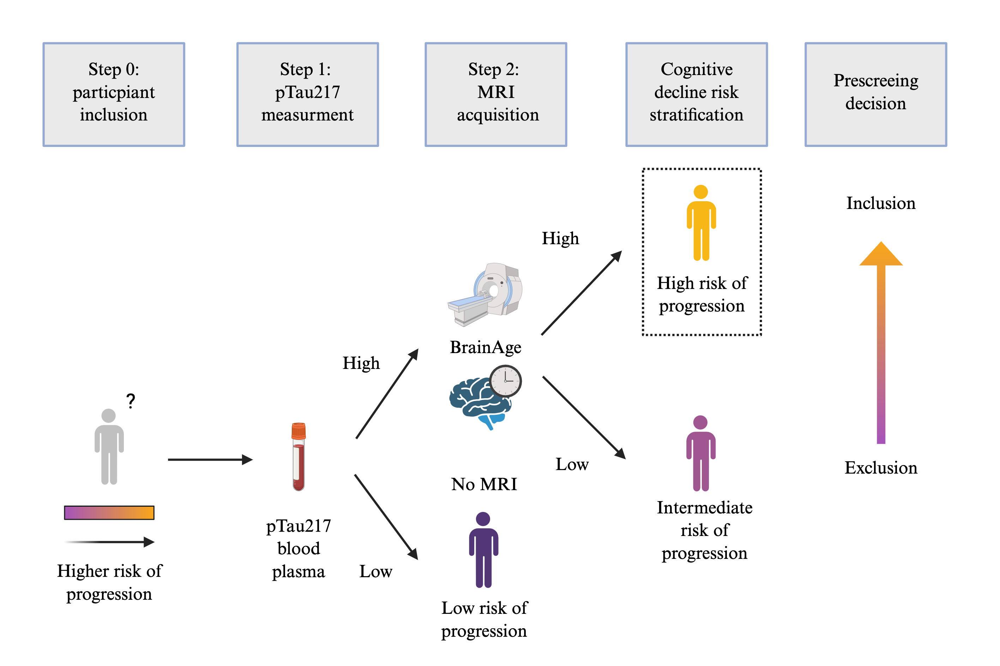

# BrainAge moderates associations between Alzheimer's diseases biomarkers and longitudinal cognitive decline

## Description

*Overview of the study design to investigate BrainAge delta as a biomarker in Alzheimer's disease.*

**(A)** BrainAge models were trained using neuroimaging features from Aβ− and APOEε4 non-carriers and then applied to other participants to estimate BrainAge delta. Models were trained separately for each cohort. In ADNI, the BrainAge model was trained on cognitively unimpaired participants and then applied to mild cognitive impairment participants.

**(B)** BrainAge deltas were used in a linear mixed-effects model to evaluate their interaction with longitudinal cognitive decline (PACC) and different biomarkers (Aβ-PET, pTau217, Tau-PET).

**(C)** There was a primary analysis carried out with all participants who had an MRI scan, longitudinal PACC measurements, and an Aβ-PET scan. An exploratory analysis was carried out with participants who had all previous datapoints and measurements of pTau217 and Tau-PET. Each square shows the number of participants in each cohort and analysis.

*Overview of clinical trial enrichment procedure.*

Conceptual framework of a sequential two-step recruitment strategy of a clinical trial in preclinical AD using a cognitive endpoint. We followed procedures similar to those by Ossenkopple et al. 2025, Nature Ageing. 

## How to cite

J. Garcia Condado, H. M. Klinger, C. Birkenbihl, M. Cuppels, A. Liu, I. Tellaetxe Elorriaga, M. Seto, G. T. Couglan, M. J. Properzi, D. M. Rentz, A. P. Schultz, A. Erramuzpe, H. Yang, J. Chhatwal, K. A. Johnson, B. C. Healy, J. M. Cortes, R. A. Sperling, M. Donohue, T. J. Hohman, I. Diez, R. F. Buckley, the Alzheimer’s Disease Neuroimaging Initiative, "BrainAge moderates associations between Alzheimer’s disease biomarkers and cognitive decline: a meta-analysis across A4/LEARN, HABS and ADNI cohorts" *medRxiv*, doi: 10.1101/2025.07.07.25331026

@article {Garcia Condado2025.07.07.25331026,
	author = {Garcia Condado, Jorge and Klinger, Hannah M and Birkenbihl, Colin and Cuppels, Madison and Liu, Annie and Tellaetxe Elorriaga, I{\~n}igo and Seto, Mabel and Couglan, Gillian T. and Properzi, Michael J. and Rentz, Dorene M. and Schultz, Aaron P. and Erramuzpe, Asier and Yang, Hyun-Sik and Chhatwal, Jasmeer and Johnson, Keith A. and Healy, Brian C. and Cortes, Jesus M. and Sperling, Reisa A. and Donohue, Michael and Hohman, Timothy J. and Diez, Ibai and Buckley, Rachel F. and the Alzheimer{\textquoteright}s Disease Neuroimaging Initiative},
	title = {BrainAge moderates associations between Alzheimer{\textquoteright}s disease biomarkers and cognitive decline: a meta-analysis across A4/LEARN, HABS and ADNI cohorts},
	elocation-id = {2025.07.07.25331026},
	year = {2025},
	doi = {10.1101/2025.07.07.25331026},
	publisher = {Cold Spring Harbor Laboratory Press},
	URL = {https://www.medrxiv.org/content/early/2025/07/10/2025.07.07.25331026},
	eprint = {https://www.medrxiv.org/content/early/2025/07/10/2025.07.07.25331026.full.pdf},
	journal = {medRxiv}
}
